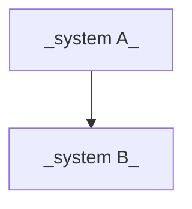

# Systems map

> The organization's systems and how they relate. An agent working in one
> repo uses this to know what sits upstream/downstream of its change.

## Diagram

## Inventory

| System | Repo (see repos.yaml) | What it does | Stack | Owner | Criticality | Status |
|---|---|---|---|---|---|---|
| _PENDING_ | | | | | | |
