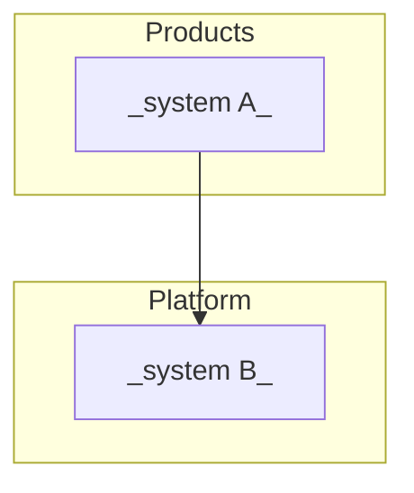

# Systems map

> The organization's systems/repos and how they relate. An agent working in one
> repo uses this map to know what sits upstream and downstream of its change.

## Diagram

## Inventory

| System | Repo | What it does | Stack | Owner | Criticality |
|---|---|---|---|---|---|
| _PENDING_ | | | | | |
