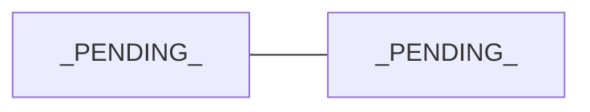

# Domain entities

> The core business entities and their relationships. This is not the database
> schema: it is the shared conceptual model. Each entity: what it is, key
> attributes, lifecycle rules (how it is created, changes state, is deleted),
> and which system holds its source of truth.

## Quick map

## Entities

### _Example entity_

- **What it is:** _PENDING_
- **Key attributes:** _PENDING_
- **Lifecycle:** _PENDING_
- **Source of truth:** _system/table/service_
- **Cautions:** _rules an agent must not violate when touching code that handles it_
